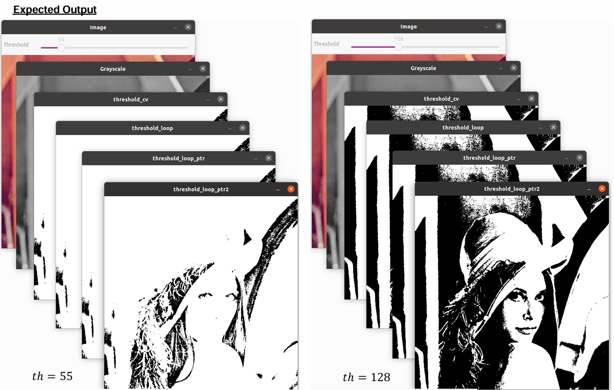

# 02_threshold

## 1. Introduction to cv::Mat 
In OpenCV, real-world images captured via cameras or scanners are stored in a digital container called cv::Mat1. This container stores intensity information in an array format.

### Data Representation in Memory
There are two ways an image is typically stored in memory:
- **Line by line representation:** Every single row is saved as an individual object in memory.
- **Continuous representation:** The entire picture is saved as a single object in memory without gaps at the end of rows.

### Checking for Continuity
Checking if a matrix is continuous is vital for optimizing data access.
- **bool ``Mat::isContinuous()``:** Returns true if elements are stored continuously without gaps.
- Sub-images: If you extract a subpart of an image, the resulting matrix is not continuous.
- Pointer Logic: Processing non-continuous images requires specific pointer algorithms to jump to the first cell of the next row (e.g., increasing a pointer by a specific offset).

## 2. Image Data Access Methods
There are three primary ways to access pixel data in a cv::Mat, each with different performance characteristics:

### Method 1: The ``.at<T>(i, j)`` Method
This is the easiest method but also the slowest.
````C++ 
cv::Mat img = cv::imread("lena.tiff");
for (int r = 0; r < rows; ++r) {
    for (int c = 0; c < cols; ++c) {
        std::cout << img.at<uchar>(r, c) << std::endl;
    }
}
````
### Method 2: Pointer with Index
This method is faster than .at but is not the absolute fastest solution.
````C++
cv::Mat img = cv::imread("lena.tiff");
if (img.isContinuous()) {
    cols = rows * cols;
    rows = 1;
}
for (int r = 0; r < rows; ++r) {
    const uchar *pInput = img.ptr<uchar>(r);
    for (int c = 0; c < cols; ++c) {
        std::cout << pInput[c] << std::endl;
    }
}
````
### Method 3: Pointer without Index (Address Increment)
This is the fastest solution for data access.
````C++
cv::Mat img = cv::imread("lena.tiff");
if (img.isContinuous()) {
    cols = rows * cols;
    rows = 1;
}
for (int r = 0; r < rows; ++r) {
    const uchar *pInput = img.ptr<uchar>(r);
    for (int c = 0; c < cols; ++c) {
        std::cout << *pInput << std::endl;
        ++pInput; // Directly increment the address
    }
}
````

## 3. Thresholding Theory
Thresholding creates a binary image used for simple segmentation tasks. The mathematical operation is defined as:
$$J(m,n)=\begin{cases}0,&if~I(m,n)<th\\ 255,&if~I(m,n)\ge th\end{cases}$$
Where $th$ is the threshold value (e.g., 64, 128, or 192).

## 4. Exercise: Implementation
### Objective: 
Implement thresholding using all three access methods described above.

### Requirements:
The program will display 6 windows
- **Main Window:** Colored image with a threshold slider.
- **Grayscale Image:** The source image converted to gray.
- **threshold_cv:** Thresholding using the built-in OpenCV function
- **threshold_loop:** Implementation using Method 1.
- **threshold_loop_ptr:** Implementation using Method 2
- **threshold_loop_ptr2:** Implementation using Method 3

**Goal:** All four thresholded images must be identical.

