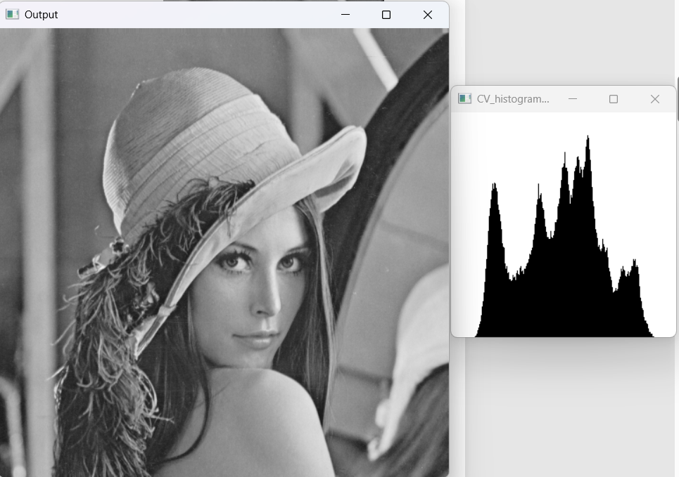
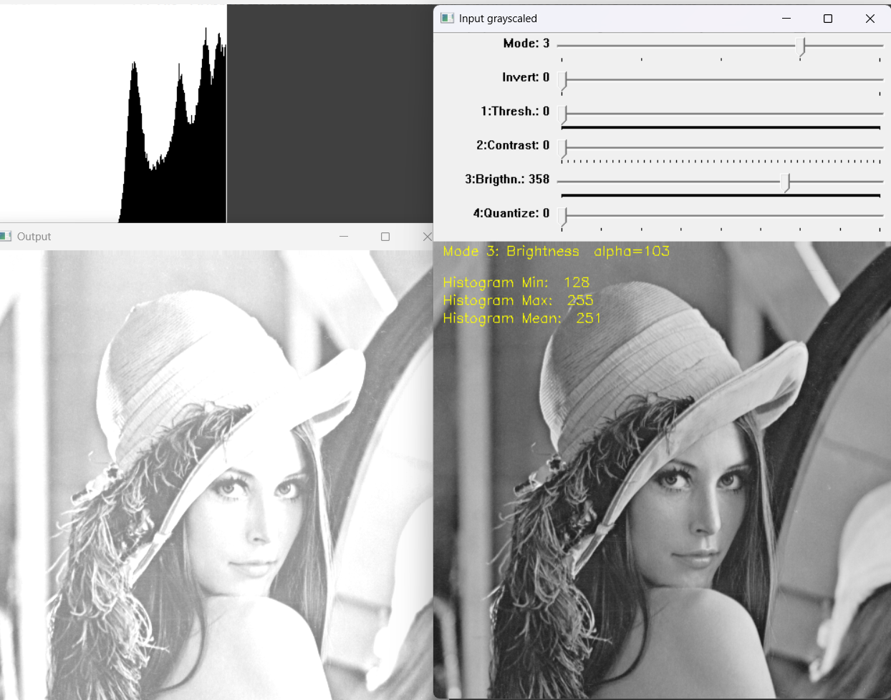
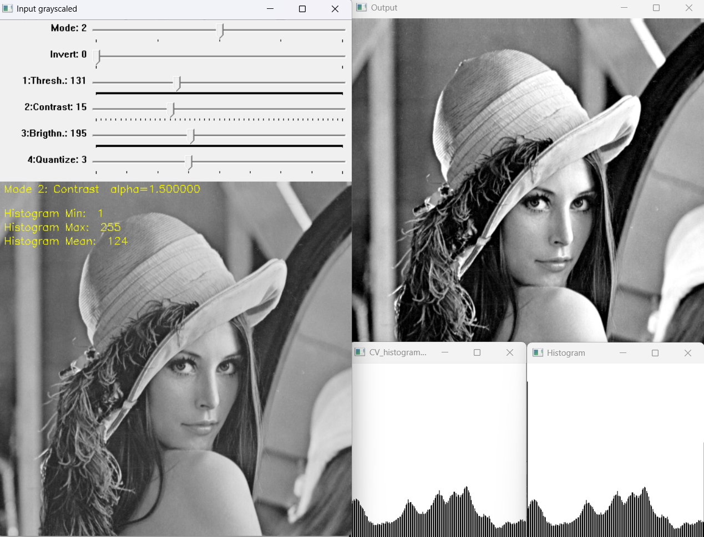
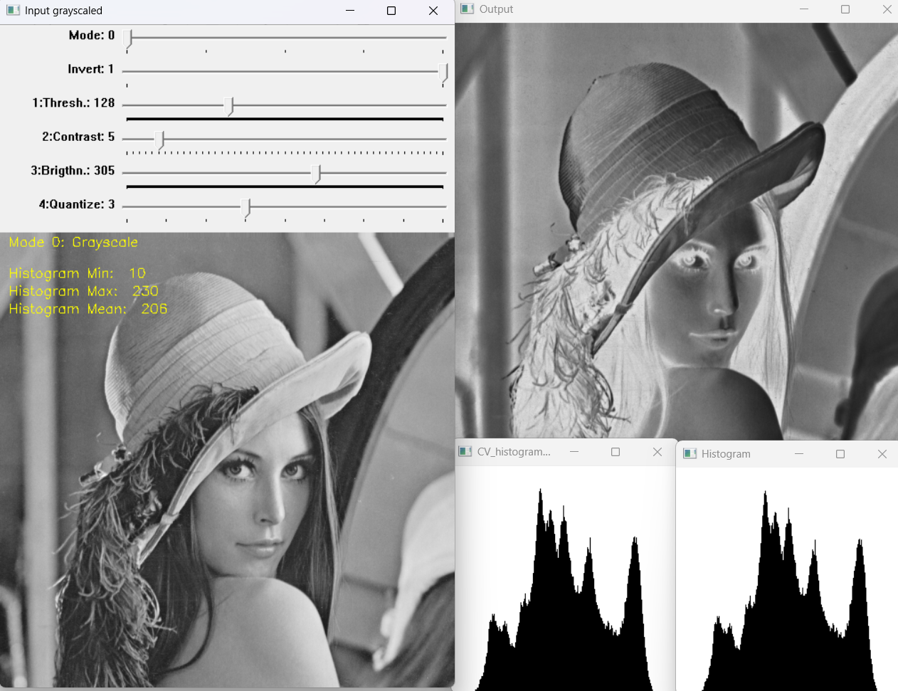

# 1. Histogram Fundamentals

A histogram is a vector where each element represents a quantized measurement of intensity levels within an image.

**Quantization Levels**: For an -bit resolution, there are  quantization levels.
* Example: 8-bit resolution results in  entries.

**Content**: Each element contains the total count of pixels whose value corresponds to that specific index.

### MATLAB Histogram Implementation

```matlab
% Read image
I = imread('image.bmp'); [rows, cols] = size(I); 

% Initialize histogram with zeros
h = zeros(256, 1);

% Iterate over all pixels and increment histogram values
for n = 1:rows
    for m = 1:cols
        h(I(n,m) + 1) = h(I(n,m) + 1) + 1;
    end
end

% Show histogram
bar(h);
```


# 2. Statistical Operations

Histograms allow for the calculation of key image characteristics:

### Mean Value ($\mu$)

Provides information about the overall **brightness** of the image.

* **From Histogram**: $\mu = \sum_{i_{min}}^{i_{max}} i \cdot h_n(i)$

* **From Image**: $$\mu = \frac{1}{M \cdot N} \sum_{m=0}^{M-1} \sum_{n=0}^{N-1} I(n, m)$$

### Variance ($\sigma^2$)

Provides information about the **dispersion** (contrast) of the values.

* **From Histogram**: $\sigma^2 = \sum_{i_{min}}^{i_{max}} (i - \mu)^2 \cdot h_n(i)$ 

* **From Image**: $$\sigma^2 = \frac{1}{M \cdot N} \sum_{m=0}^{M-1} \sum_{n=0}^{N-1} I^2(n, m) - \mu^2$$

# 3. Point Operations

Point operations transform an input image  into an output image  based on specific functions.

### Brightness Adjustment
$$f(m,n) = I(m,n) + a, \quad a \in [-255, 255]$$
Values must be clipped to the range  to avoid overflow/underflow.


### Contrast Adjustment
$$f(m,n) = a(I(m,n) - s) + s, \quad a, s \in [0, 255]$$
* $s$: The center of the contrast function (typically 127).
* $a>1$: Increases contrast.
* $0 \le a < 1$: Decreases contrast.


### Inversion
$$J(m,n) = 255 - I(m,n)$$
This operation results in a "flipped" histogram.


# 4. Binning (Quantization)

To reduce histogram size for high bit-depth images (e.g., 14-bit), intensity values are grouped into $B$ intervals called **bins**.

* **Interval size**: $k_B = K/B$
* **Bin index calculation**: $$j = \lfloor I(m,n) \cdot \frac{B}{K} \rfloor$$

# 5. Exercise 3

**Objective**: Implement histogram calculation and the following point operations:

* **Adjusted Brightness** 
* **Quantization (Binning)** 
* **Inversion** 

